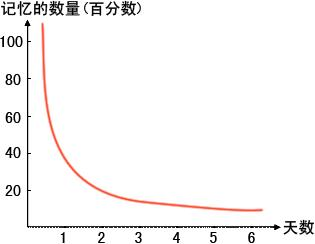
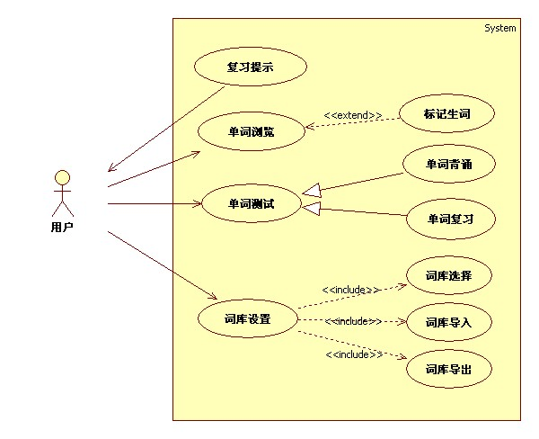
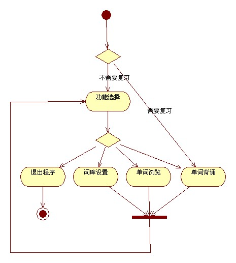
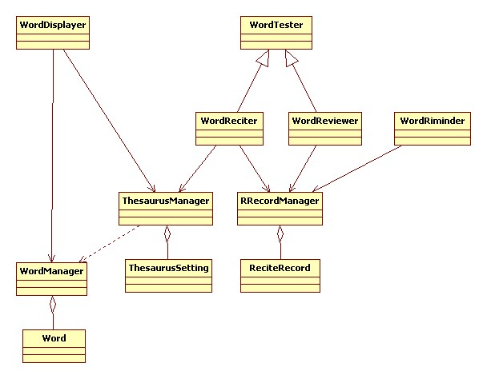
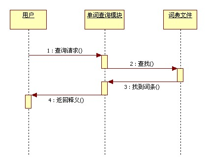
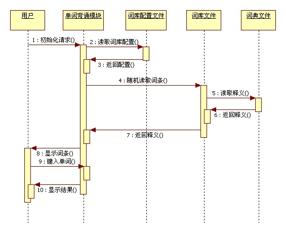

# Hello Word

用 JAVA(J2SE) 实现的一个背单词程序，可自由选择词库。

## 1 绪论
### 1.1 选题目的及意义
随着国际化的发展，英语变得越来越为重要。随着越来越多的人开始学习英语，一个方便实用的英汉查询工具为人们所渴望。电子词典是一种将传统的印刷词典转成数码方式、进行快速查询的数字学习工具。使用电子词典查询英语，效率远远高于传统的图书查询，而且解释更为详尽，词库更新更为方便快捷。作为大学生，很多人都面临着CET, TOFEL, ILETS, GRE, GMAT等各种英语水平考试的压力，好的学习方法和工具可以使得英语学习事半功倍。出于此目的，本软件应运而生。
### 1.2 艾宾浩斯记忆曲线
#### 1.2.1 记忆规律曲线解释
德国心理学家艾宾浩斯(H.Ebbinghaus)研究发现，遗忘在学习之后立即开始，而且遗忘的进程并不是均匀的。最初遗忘速度很快，以后逐渐缓慢。他认为＂保持和遗忘是时间的函数＂，并根据他的实验结果绘成描述遗忘进程的曲线，即著名的艾宾浩斯记忆遗忘曲线。图1-1。

图1-1 艾宾浩斯遗忘曲线

这条曲线告诉人们在学习中的遗忘是有规律的，遗忘的进程很快，并且先快后慢。观察曲线，你会发现,学得的知识在1天后，如不抓紧复习，就只剩下原来的25%。随着时间的推移，遗忘的速度减慢，遗忘的数量也就减少。
根据我们所知道的，记忆的保持在时间上是不同的，有短时的记忆和长时的记忆两种。而我们平时的记忆的过程是这样的：输入的信息在经过人的注意过程的学习后，便成为了人的短时的记忆，但是如果不经过及时的复习，这些记住过的东西就会遗忘，而经过了及时的复习，这些短时的记忆就会成为了人的一种长时的记忆，从而在大脑中保持着很长的时间。那么，对于我们来讲，怎样才叫做遗忘呢，所谓遗忘就是我们对于曾经记忆过的东西不能再认起来，也不能回忆起来，或者是错误的再认和错误的回忆，这些都是遗忘。艾宾浩斯在做这个实验的时候是拿自己作为测试对象的，他得出了一些关于记忆的结论。他选用了一些根本没有意义的音节，也就是那些不能拼出单词来的众多字母的组合， 

图1-2 艾宾浩斯遗忘规律

比如asww，cfhhj，ijikmb，rfyjbc等等。他经过对自己的测试，得到了一些数据。然后，艾宾浩斯又根据了这些点描绘出了一条曲线，这就是非常有名的揭示遗忘规律的曲线：艾宾浩斯遗忘曲线，图中竖轴表示学习中记住的知识数量，横轴表示时间(天数)，曲线表示记忆量变化的规律。这条曲线告诉人们在学习中的遗忘是有规律的，遗忘的进程不是均衡的，不是固定的一天丢掉几个，转天又丢几个的，而是在记忆的最初阶段遗忘的速度很快，后来就逐渐减慢了，到了相当长的时候后，几乎就不再遗忘了，这就是遗忘的发展规律，即"先快后慢"的原则。观察这条遗忘曲线，你会发现,学得的知识在一天后，如不抓紧复习,就只剩下原来的25%)。随着时间的推移,遗忘的速度减慢，遗忘的数量也就减少。有人做过一个实验，两组学生学习一段课文，甲组在学习后不久进行一次复习，乙组不予复习，一天后甲组保持98%，乙组保持56%；一周后甲组保持83%，乙组保持33%。乙组的遗忘平均值比甲组高。通过艾宾浩斯记忆法，与现代个人计算机相结合，为用户提供比传统背单词方式更加简单、科学、高效的背单词。
#### 1.2.2 复习点的确定
人的记忆周期分为短期记忆和长期记忆两种。

第一个记忆周期是 5分钟  
第二个记忆周期是30分钟  
第三个记忆周期是12小时  

这三个记忆周期属于短期记忆的范畴。  
下面是几个比较重要的周期。

第四个记忆周期是 1天  
第五个记忆周期是 2天  
第六个记忆周期是 4天  
第七个记忆周期是 7天  
第八个记忆周期是15天  

以上的8个周期应用于背词法，作为一个大的背词的循环的8个复习点，可以最大程度的提高背单词的效率

### 1.3 系统概述

#### 1.3.1 软件名称
WhyNotMemorise（英语学习助手）

#### 1.3.2 软件功能
基于艾宾浩斯记忆曲线，为学生提供简单、科学、高效的背单词方法。

#### 1.3.3 用户
小学生、中学生、大学生、教师、各类英语学习者。

### 1.3.4 开发者
王浩宇 (whypro)

## 2 需求分析

### 2.1 需求概述

#### 2.1.1 系统目标
为学生提供简单、科学、高效的背单词方法。使学生背单词的效率显著提高。

#### 2.1.2 运行环境
软件需求：Windows/Linux + JRE 1.6

#### 2.1.3 用户特点
熟悉英语，熟悉计算机基本操作。

### 2.2 功能需求

#### 2.2.1 用例图

图2-1 系统用例图

#### 2.2.2 活动图

图2-2 活动图

1. 单词浏览  
可通过直接浏览、查找的方式对要背诵的单词进行浏览，在浏览过程中，可将单词加入生词库，并设置“陌生度”。陌生度将决定日后单词提醒复习的频率，与提醒频率呈对数关系。

2. 单词背诵  
根据词库设置，显示对应单词的音标和中文释义，要求用户输入英文单词，按回车键后，系统提示正误，并将背诵记录写入背诵记录文件。

3. 单词复习  
软件读取背诵记录文件，智能提示是否有需要背诵的单词，以与“单词背诵”功能相同的方式再次记忆先前的单词。

4. 词库设置  
可选择文件，作为浏览和背诵的词库。并进行导入导出操作。

5. 词汇统计  
统计已记忆的单词，显示“单词”“首次记忆时间”“上次记忆时间”“阶段”“陌生度”等信息。这些数据直接关系着按记忆曲线背诵的进行。

### 2.3 性能需求

#### 2.3.1 精度
要求系统准确定位单词的存储位置，并精确地获得词条、音标以及释义。

#### 2.3.2 时间特性要求
要求系统显示释义的时间不超过100毫秒。键盘响应时间不超过10毫秒。

#### 2.3.3 输入输出需求
输入和输出都采用文件的方式。词库使用文本格式存储。

#### 2.3.4 其他需求
界面小巧、简洁、美观。

## 3 总体设计

### 3.1 系统结构
### 3.2 类图

图3-1 类图

#### 3.2.1 单词浏览
可通过直接浏览、查找的方式对要背诵的单词进行浏览，在浏览过程中，可将单词加入生词库，并设置“陌生度”。顺序图如图3-2

图3-2 单词浏览模块顺序图

#### 3.2.2 单词背诵
根据词库设置，显示对应单词的音标和中文释义，要求用户输入英文单词，按回车键后，系统提示正误，并将背诵记录写入背诵记录文件。顺序图如 图3-3

图3-3 单词背诵模块协作图

## 4 详细设计
软件的主要类如图4-1

图4-1 类图

### 4.1 WordManager: 
* 词条管理器，主要负责读取字典文件。
* 字典文件由*.idx与*.dict两个文件构成，其中idx为索引文件，其格式为：{word (以’\0’结尾)}{offset (4byte)}{size (4byte)}，dict为二进制文件，保存着单词的解释。WordManger通过分析idx中的信息访问dict文件获取释义。
* +getWordAndInterp(): 获取单词、音标以及释义。

### 4.2 WordTester: 
抽象类，包含鼠标键盘事件处理，实现单词测试的功能。

* +newRandomWord(): 从词库中随机抽取一个单词。
* +getTestWord(): 获得该单词的音标和释义。
* +chooseThesaurus(): 选择词库。
* +keyTyped(): 键盘事件处理。

### 4.3 WordReciter: 
继承WordTester，实现单词首次背诵功能。

### 4.4 WordReviewer: 
继承WordTester，实现单词复习功能。

### 4.5 WordReminder: 
获得系统时间，智能、定时地提醒用户复习单词。

### 4.6 RRecordManager: 
背诵记录管理器，主要负责读取单词的背诵记录以及将其写入背诵记录文件。背诵记录文件的结构为：

    String // 单词
    long // 首次记忆时间
    long // 上次记忆时间
    int // 阶段
    int // 陌生度

* +saveRRecords(): 将背诵记录写入背诵记录文件。
* +loadRRecords(): 从背诵记录文件中读取背诵记录。

### 4.7 WordDisplayer: 
访问字典文件，通过单词检索音标与释义。并显示于用户界面。

### 4.8 ThesaurusManager: 
词库管理器，读取写入词库配置信息，并依据配置信息读取词库文件。词库文件仅由单词组成。

* +calcIndexBound(): 测试词库文件边界，计算词库文件中单词数目。

## 5 系统实现
### 5.1 开发环境
* RedHat Fedora Linux 13
* Eclipse 3.5.2
* JRE 1.6

### 5.2 关键技术
#### 5.2.1 背诵记录文件的读写
考虑到软件的规模和适应人群，本软件没有使用DBMS，而使用了文件管理，因此使用了大量的文件输入输出。关键代码如下：
    // RRecordGetter.java
    package whypro.memorize;
    
    import java.io.FileInputStream;
    import java.io.FileOutputStream;
    import java.io.IOException;
    import java.io.ObjectInputStream;
    import java.io.ObjectOutputStream;
    import java.util.Vector;
    
    class RRecordGetter {
    // 将传入的Vector写入filePath（背诵记录文件）文件中
    public static boolean saveRRecords(
        String filePath, Vector<ReciteRecord> vect) {
        try {
            ObjectOutputStream outputStream =
            new ObjectOutputStream(
            new FileOutputStream(filePath));
            // 遍历vect，并写入记录文件
            for (ReciteRecord i : vect) {
            outputStream.writeUTF(i.word);
            outputStream.writeLong(i.startDate);
            outputStream.writeLong(i.lastDate);
            outputStream.writeInt(i.stage);
            outputStream.writeInt(i.strange);
            }
            outputStream.close();
        } catch (IOException e) {
            System.out.println(e.getMessage());
            return false;
        }
        return true;
    }
    
    // 读取记录文件，返回Vector
    public static Vector<ReciteRecord> loadRRecords(
        String filePath, int n) {
            Vector<ReciteRecord> vect = new Vector<ReciteRecord>();
            try {
                ObjectInputStream inputStream =
                new ObjectInputStream(
                new FileInputStream(filePath));
                for (int i = 0; i < n; ++i) {
                ReciteRecord temp = new ReciteRecord();
                temp.word = inputStream.readUTF();
                temp.startDate = inputStream.readLong();
                temp.lastDate = inputStream.readLong();
                temp.stage = inputStream.readInt();
                temp.strange = inputStream.readInt();
                vect.addElement(temp);
                }
                inputStream.close();
            } catch(Exception e) {
                System.out.println(e.getMessage());
            }
            return vect;
        }
    }

#### 5.2.2 词库文件的读取
    // WordManager.java
    package whypro.memorize;
    
    import java.io.BufferedReader;
    import java.io.FileReader;
    import java.io.IOException;
    import java.util.Random;
    
    public class WordManager {
        protected String filePath;
    	protected String fileName;
    	protected int index;
    
    	protected int indexBound;
    	
    	protected String word;
    	protected String phonetic;
    	protected String interp;
    	protected String thesName;
    	
    	public WordManager(String filePath, String fileName) throws IOException {
    		this.filePath = filePath;
    		this.fileName = fileName;
    		calcIndexBound();
    	}
    	
    	public void getWordAndInterp() throws IOException {
    		Random random = new Random(System.currentTimeMillis());
    		this.index = Math.abs(random.nextInt() % indexBound);
    		
    		FileReader fr = new FileReader(filePath + '/' + fileName);
    		BufferedReader br = new BufferedReader(fr);
    		String line = br.readLine();    // 词库名称
    		thesName = line;
    		for (int i = 0; i < 4 * index; i++) {
    			line = br.readLine();
    		}
    		while (!line.equals("")) {
    			line = br.readLine();
    		}
    		
    		this.word = br.readLine();
    		this.phonetic = br.readLine();
    		this.interp = br.readLine();
    		br.close();
    		fr.close();
    	}
    	
    	public void calcIndexBound() throws IOException {
    		FileReader fr = new FileReader(filePath + '/' + fileName);
    		BufferedReader br = new BufferedReader(fr);
    		String line = br.readLine();	// 词库名称
    		int indexBound = 0;
    		while (line != null) {
    			if (line.equals("")) {
    				indexBound++;
    			}
    			line = br.readLine();
    		}
    		this.indexBound = indexBound;
    		br.close();
    		fr.close();
    	}
    	
    }

#### 5.2.3 统计已背诵的单词：
    // ReciteStat.java
    package whypro.memorize;
    
    import java.awt.BorderLayout;
    import java.awt.Dimension;
    import java.awt.Toolkit;
    import java.text.DateFormat;
    import java.text.SimpleDateFormat;
    import java.util.Date;
    import java.util.Vector;
    
    import javax.swing.JFrame;
    import javax.swing.JPanel;
    import javax.swing.JScrollPane;
    import javax.swing.JTable;
    
    class ReciteStat extends JFrame {
    
    	final JTable table;
    	Vector<ReciteRecord> recordsVector;
    	public ReciteStat() {
    		JPanel mainPanel = new JPanel();
    		mainPanel.setLayout(new BorderLayout());
    		// 从记录文件中读取单词背诵记录并存入Object[][] o中
    		recordsVector = RRecordGetter.loadRRecords("./record/recite.rec", 100);
    		Object[][] o = new Object[recordsVector.size()][5];
    		int j = 0;
    		DateFormat format = new SimpleDateFormat("yyyy-MM-dd HH:mm:ss"); 
    		String str = null;
    		
    		for (ReciteRecord i : recordsVector) {
    			o [j][0] = i.word;
    			str = format.format(new Date(i.startDate));
    			o [j][1] = str;
    			str = format.format(new Date(i.lastDate));
    			o [j][2] = str;
    			o [j][3] = i.stage;
    			o [j][4] = i.strange;
    			++j;
    		}
    		
    		String[] names = {"单词", "首次记忆时间", "上次记忆时间", "记忆阶段", "陌生度"}; 
    		table = new JTable(o, names);
    
    		mainPanel.add(new JScrollPane(table));
    		
    		this.add(mainPanel);
    		// 
    		this.setTitle("背诵情况统计");
    		this.setSize(600, 400);
    		this.setResizable(false);
    
    		// 使窗口居中
    		Toolkit kit = Toolkit.getDefaultToolkit(); // 定义工具包
    		Dimension screenSize = kit.getScreenSize(); // 获取屏幕的尺寸
    		int screenWidth = screenSize.width / 2; // 获取屏幕的宽
    		int screenHeight = screenSize.height / 2; // 获取屏幕的高
    		int height = this.getHeight();
    		int width = this.getWidth();
    		// 使窗口居中
    		setLocation(screenWidth - width / 2, screenHeight - height / 2);
    		this.setVisible(true);
    	}
    }

#### 5.2.4 访问自定义字体文件
由于软件需要显示音标，因此定义了MyFont类，用于使用自定义字体显示单词的音标。关键代码如下：

    // MyFont.java
    package whypro.memorize;
    
    import java.awt.Font;
    import java.awt.FontFormatException;
    import java.io.BufferedInputStream;
    import java.io.File;
    import java.io.FileInputStream;
    import java.io.IOException;
    
    public class MyFont {
    	public static Font getFont(String filePath, String fileName, int style, float size)
    			throws FontFormatException, IOException {
    		File file = new File(filePath + '/' + fileName);
    		FileInputStream fi;
    		BufferedInputStream fb;
    		Font font = null;
    		fi = new FileInputStream(file);
    		fb = new BufferedInputStream(fi);
    		// 创建自定义字体
    		font = Font.createFont(Font.TRUETYPE_FONT, fb);
    		font = font.deriveFont(style, size);
    		return font;
    	}
    }

#### 5.2.5 GridBagLayout布局方式
软件使用了Swing更强大的GridBagLayout布局方式，代码如下：

    // WordTester.java
    package whypro.memorize;
    
    import java.awt.*;
    import java.awt.event.*;
    import java.io.IOException;
    import java.util.Vector;
    
    import javax.swing.*;

​    
    class WordTester extends JFrame implements KeyListener, ActionListener {
    
    	private static final long serialVersionUID = 1L;
    
    	WordManager randomWord;
    
    	final private JPanel mainPanel;
    	final private JLabel lblEnglish;
    	final private JLabel lblPhonetic;
    	final private JTextArea txtChinese;
    	final private JLabel lblStatus;
    
    	final private JMenuBar menuBar = new JMenuBar();
    	final private JMenu fileMenu = new JMenu("文件 (F)");
    	final private JMenuItem chooseThItem = new JMenuItem("选择词库 (T)");
    	final private JMenuItem statItem = new JMenuItem("词汇统计 (S)");
    	final private JMenuItem exitItem = new JMenuItem("退出 (X)");
    	final private JMenu helpMenu = new JMenu("帮助 (H)");
    	final private JMenuItem aboutItem = new JMenuItem("关于 (A)");
    
    	String strEnglish;	// 单词
    	String strPhonetic;	// 音标
    	String strChinese; // 释义
    	String strTName;	// 词库名
    	String strSpelling = "";
    	int wordLength;	// 单词长度
    	int strange = 0;	// 陌生度
    
    	// 标志位，忽略一次Type事件
    	boolean isCorrect = false;

​    
​    
    	String fontPath = "./font";	// 字体路径
    	String fontName = "TOPhonetic.ttf";
    	String thesPath = "./thesaurus/TOFEL.txt";	// 词库路径
    	String thesName = "";	
    	
    	String recordPath = "./record/recite.rec";	// 背诵记录文件路径
    	
    	Vector<ReciteRecord> recordsVector = new Vector<ReciteRecord>();	// 背诵记录
    
    	public WordTester() {
    		setDefaultCloseOperation(JFrame.EXIT_ON_CLOSE);
    		JPanel mainPanel = new JPanel();
    		mainPanel.setLayout(new GridBagLayout());
    		GridBagConstraints c = new GridBagConstraints();
    
    		// 初始化菜单栏
    		
    		fileMenu.setMnemonic('F');
    		menuBar.add(fileMenu);	
    		chooseThItem.setMnemonic('T');
    		fileMenu.add(chooseThItem);
    		chooseThItem.setMnemonic('T');
    		fileMenu.add(statItem);
    		exitItem.setMnemonic('S');
    		fileMenu.add(exitItem);
    		helpMenu.setMnemonic('H');
    		menuBar.add(helpMenu);
    		aboutItem.setMnemonic('A');
    		helpMenu.add(aboutItem);
    		
    		chooseThItem.addActionListener(this);
    		statItem.addActionListener(this);
    		exitItem.addActionListener(this);
    		aboutItem.addActionListener(this);
    		this.setJMenuBar(menuBar);

​    
    		lblEnglish = new JLabel(strEnglish);
    		lblEnglish.setBackground(Color.WHITE);
    		// lblEnglish.setFont(new Font("Bradley Hand ITC", Font.BOLD, 50));
    		lblEnglish.setFont(new Font("Arial", Font.BOLD, 50));
    		c.fill = GridBagConstraints.HORIZONTAL;
    		c.gridx = 0;
    		c.gridy = 1;
    		c.weightx = 1;
    		mainPanel.add(lblEnglish, c);
    
    		lblPhonetic = new JLabel(strPhonetic);
    		lblPhonetic.setBackground(Color.WHITE);
    
    		// 获取音标字体
    		try {
    			lblPhonetic.setFont(MyFont.getFont(
    					fontPath, fontName, Font.PLAIN,	20));
    		} catch (FontFormatException e) {
    			JOptionPane.showMessageDialog(this, e.getMessage());
    			System.exit(0);
    		} catch (IOException e) {
    			JOptionPane.showMessageDialog(this, e.getMessage());
    			System.exit(0);
    		}
    		c.fill = GridBagConstraints.HORIZONTAL;
    		c.gridx = 0;
    		c.gridy = 2;
    		c.weightx = 1;
    		c.weighty = 0.1;
    		mainPanel.add(lblPhonetic, c);
    
    		txtChinese = new JTextArea(strChinese);
    		txtChinese.setLineWrap(true);
    		txtChinese.setFont(new Font("华文仿宋", Font.PLAIN, 28));
    		//txtChinese.setBackground(Color.black);
    		//txtChinese.setForeground(Color.white);
    
    		txtChinese.setEditable(false);
    		c.fill = GridBagConstraints.BOTH;
    		c.gridx = 0;
    		c.gridy = 3;
    		c.weightx = 1;
    		c.weighty = 2;
    		mainPanel.add(txtChinese, c);
    
    		lblStatus = new JLabel(strTName);
    		// lblEnglish.setFont(new Font("Bradley Hand ITC", Font.BOLD, 50));
    		lblStatus.setFont(new Font("宋体", Font.PLAIN, 12));
    		c.fill = GridBagConstraints.HORIZONTAL;
    		c.gridx = 0;
    		c.gridy = 4;
    		c.weighty = 0.2;
    		mainPanel.add(lblStatus, c);

​    
    		txtChinese.setFocusable(false);
    		this.addKeyListener(this);
    		lblEnglish.addKeyListener(this);
    		lblPhonetic.addKeyListener(this);
    		txtChinese.addKeyListener(this);
    
    		// 软件运行时将背诵记录从文件载入内存
    		recordsVector = RRecordGetter.loadRRecords(recordPath, 100);
    		newRandomWord();

​    
    		this.add(mainPanel);
    		// 
    		this.setTitle("whyNotMemorize");
    		this.setSize(400, 400);
    		this.setResizable(false);
    
    		// 使窗口居中
    		Toolkit kit = Toolkit.getDefaultToolkit(); // 定义工具包
    		Dimension screenSize = kit.getScreenSize(); // 获取屏幕的尺寸
    		int screenWidth = screenSize.width / 2; // 获取屏幕的宽
    		int screenHeight = screenSize.height / 2; // 获取屏幕的高
    		int height = this.getHeight();
    		int width = this.getWidth();
    		setLocation(screenWidth - width / 2, screenHeight - height / 2);
    
    		this.setVisible(true);
    	}
    
    	@Override
    	public void keyPressed(KeyEvent e) {}
    
    	@Override
    	public void keyReleased(KeyEvent e) {}
    
    	@Override
    	public void keyTyped(KeyEvent e) {
    
    		// 当拼写正确时，忽略一次键盘事件，并产生新词
    		if (isCorrect) {
    			isCorrect = false;
    			newRandomWord();
    			return;
    		}
    
    		char ch = e.getKeyChar();
    		// 单词长度限制
    		if (strSpelling.length() < strEnglish.length()) {
    			// 字母限制
    			if (ch >= 'A' && ch <= 'Z' || ch >= 'a' && ch <= 'z' || ch == '-'
    				|| ch == '(' || ch == ')') {
    				lblEnglish.setForeground(Color.BLACK);
    				strSpelling += ch;
    				lblEnglish.setText(strSpelling);
    			}
    		}
    
    		// 退格键
    		if (strSpelling.length() > 0) {
    			if (ch == '\b') {
    				strSpelling = strSpelling
    				.substring(0, strSpelling.length() - 1);
    				if (strSpelling.length() > 0) {
    					lblEnglish.setText(strSpelling);
    				} else {
    					lblEnglish.setText(" ");
    				}
    			}
    		}
    
    		// 回车键
    		if (ch == '\n' || ch == ' ') {
    
    			if (strSpelling.equals(strEnglish)) {
    				// 当拼写正确时，以蓝色字体显示，并设置isCorrect标志
    				strSpelling = "";
    				lblEnglish.setForeground(Color.blue);
    				lblEnglish.setText(strEnglish);
    				isCorrect = true;
    				
    				// 生成该单词背诵数据，并写入文件
    				ReciteRecord record = new ReciteRecord(
    						strEnglish, 
    						System.currentTimeMillis(), System.currentTimeMillis(), 
    						0, strange);
    				recordsVector.addElement(record);
    				RRecordGetter.saveRRecords(recordPath, recordsVector);
    				
    			} else {
    				// 当拼写不正确时，以红色字体显示
    				strSpelling = "";
    				lblEnglish.setForeground(Color.red);
    				lblEnglish.setText(strEnglish);
    				// 陌生度
    				strange++;
    			}
    		}
    
    		// Tab键
    		if (ch == '`') {
    			newRandomWord();
    		}
    	}
    
    	public void newRandomWord() {
    		strSpelling = "";
    		strange = 0;
    		// Random random = new Random(System.currentTimeMillis());
    		// int index = Math.abs(random.nextInt() % 3000);
    		try {
    			randomWord = new WordManager(thesPath, thesName);
    		} catch (IOException e) {
    			JOptionPane.showMessageDialog(this, e.getMessage());
    			System.exit(0);
    		}
    		getTestWord();
    	}
    
    	public void setEventToLable(String strWord) {
    		lblEnglish.setText(strWord);
    	}
    
    	// 从词库文件中随机抽取一个单词
    	public void getTestWord() {
    		try {
    			randomWord.getWordAndInterp();
    		} catch (IOException e) {
    			JOptionPane.showMessageDialog(this, e.getMessage());
    			System.exit(0);
    		}
    
    		strEnglish = randomWord.word;
    		strPhonetic = randomWord.phonetic;
    		strChinese = randomWord.interp;
    		strTName = randomWord.thesName;
    
    		wordLength = strEnglish.length();
    
    		lblEnglish.setText(" ");
    		lblPhonetic.setText(strPhonetic);
    		txtChinese.setText(strChinese);
    		lblStatus.setText(strTName);
    	}
    
    	public void chooseThesaurus() {
    		JFileChooser chooser = new JFileChooser();
    		chooser.setCurrentDirectory(new java.io.File("./thesaurus"));
    		chooser.setDialogTitle("选择词库");
    		chooser.setFileSelectionMode(JFileChooser.FILES_ONLY);
    		chooser.setAcceptAllFileFilterUsed(false);
    		if (chooser.showOpenDialog(null) == JFileChooser.APPROVE_OPTION) {
    			thesPath = chooser.getSelectedFile().getPath();
    			// thesName = chooser.getSelectedFile().getName();
    			newRandomWord();

​    
    		} else {
    			return;
    		}
    	}
    
    	@Override
    	public void actionPerformed(ActionEvent e) {
    		if (e.getSource() == chooseThItem) {
    			chooseThesaurus();
    		} 
    		else if (e.getSource() == statItem) {
    			new ReciteStat();
    		}
    		else if (e.getSource() == exitItem){
    			System.exit(0);
    		}
    		else if (e.getSource() == aboutItem) {
    			JOptionPane.showMessageDialog(this,"版权所有 2011 whypro\n献给... Q");
    		}
    
    	}
    }

## 6. 系统测试
### 6.1 主界面
软件的默认词库为《TOFEL》，第一部分是单词拼写区域。第二部分是音标区域，用于显示该单词的音标。第三部分为释义部分，用于显示单词的解释。第四部分为词库信息，显示词库的名称等相关信息

图5-1 主界面

### 6.2 单词背诵
可通过键盘输入单词，退格键删除最后一个字母，ESC键清空输入，回车键确定，“\`”键跳过该单词。

图5-2 单词背诵

当单词拼写正确时，单词会以蓝色显示。

图5-3 单词拼写正确

当单词拼写错误时，单词会以红色显示，该单词的陌生度加1

图5-4 单词拼写错误

### 6.3 词库选择
单击【文件】【选择词库】，或快捷键【F】【T】进行词库选择。

图5-5 词库选择1

图5-6 词库选择2

### 6.4 词汇统计
单击【文件】【词汇统计】，或快捷键【F】【S】统计历史背诵的单词。如图5-7：

其中，记忆阶段分为八个阶段，详见绪论部分；陌生度即单词拼写错误的次数，越高代表对此单词越陌生。

图5-7 词汇统计

## 7. 致谢
本软件的构思来源于传统枯燥、缓慢的单词记忆过程。在这几周代码编写的过程中，本人遇到的主要问题在于前期类的划分与后期文件的输入输出处理，由于时间的仓促，早期的设想没有体现在设计报告中，而设计报告中有些功能没有被后期实现。而且由于本人出于对软件细节尽可能完美实现的目的，把主要精力放在了词典文件结构的研究上，加之对Java文件处理与GUI设计不够精通，导致整个开发过程进行的十分缓慢，但是在此郑重声明，本程序代码完全由自己编写，除了参考了C++开源项目star-dict的词典文件结构外，没有盗用网络上任何已发布的程序。希望得到罗老师和周老师的认可和肯定。

当然，此次课程设计只开发出了软件原型。虽然课程设计已经结束，但是本人对该项目的热情没有冷却，因此计划日后与同学合作，使用自己更擅长的C++重新编写，并将单词查询功能与记忆功能加以完善，坚持简洁、小巧、美观的特性。在此过程中，会遇到很多很多未知的问题，希望两位老师能在百忙之中给予指导。

在这三周的时间里，本人切实地意识到了软件工程学科的重要性，在此感谢罗晓霞老师的悉心讲授以及为我们专业所做的一切。同时感谢周筱媛老师为我们整个学期Java程序设计课程的讲授，同时在用Java实现代码的过程中，感谢周老师耐心地答疑。

## 参考文献

1. 李文泽. Java程序设计专家门诊. 清华大学出版社. 2006. 234~302页
2. [美]Walter Savitch 著. 陈涓 赵振平 译. Java程序设计与问题解决 高级篇（第4版）. 人民邮电出版社. 2007. 53~98页
3. 陈明. 软件工程实用教程. 电子工业出版社. 2004. 306~359页
4. 张海潘. 软件工程导论. 清华大学出版社. 2008
5. 刘启辉. 艾宾浩斯遗忘曲线在英语词汇记忆中的应用. 山东 青岛. 青岛理工大学. 科教文汇 2009(26)
6. 姚天顺 张俐 高竹. WordNet综述. 东北大学. 语言文字应用 2001(1)
7. [美]霍罗维兹 等著. 张力 等译. 数据结构基础. 清华大学出版社. 2009
8. [美]安茹 等著. 束尧 丁凡 许国梁 译. Eclipse权威开发指南（第2版）. 清华大学出版社. 2006
9. [美]Drozdek，A. 著. 周翔 译. 数据结构与算法-Java语言版（第2版）. 机械工业出版社. 2006
10. Swing布局详解 (http://hainianqinas.javaeye.com/blog/430808)
11. Java集合类全接触 http://www.sunxin.org/forum/thread/19837.html
12. 开源词典：StarDict 星际译霸 http://coffeejp.com/bbs/thread-128153-1-1.html
13. StarDict词典格式 
http://hi.baidu.com/shoru/blog/item/4cb8b3c2fed6a5180ef4779c.html
14. 读取StarDict里的字典文件 http://msino.javaeye.com/blog/361888
15. Java读取星际译王(StarDict)词库
http://88250.b3log.org/articles/2008/03/10/1205143800000.html
16. Forgetting curve （http://en.wikipedia.org/wiki/Forgetting_curve）
17. Java™ Platform, Standard Edition 6 API Specification 
http://download.oracle.com/javase/6/docs/api/
18. Using Text Components (http://download.oracle.com/javase/tutorial/uiswing/components/text.html)
19. WordNet http://wordnet.princeton.edu/

***
By whypro  
2011-01
